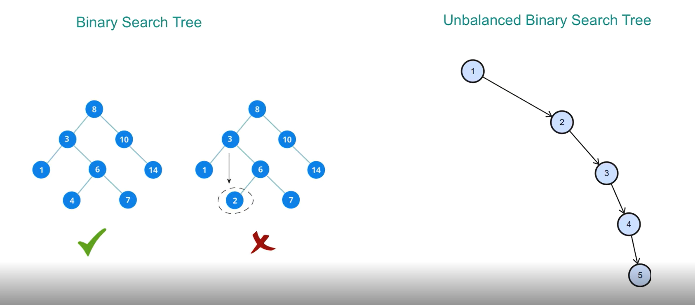
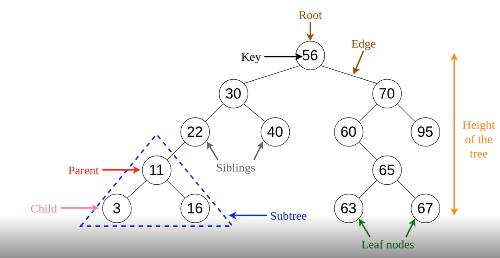
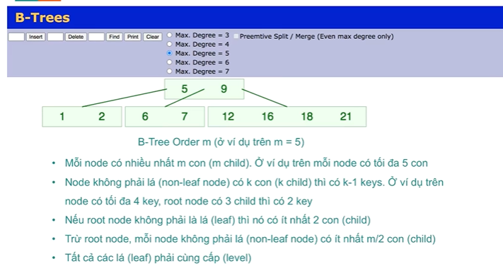
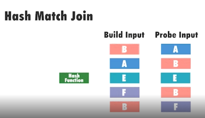
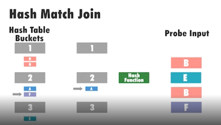
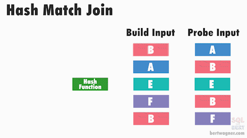
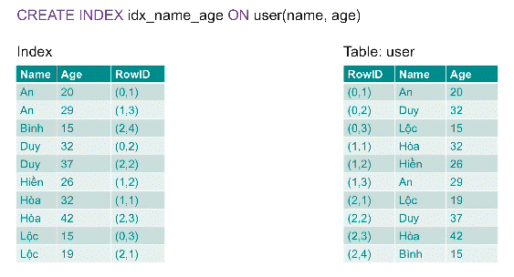

# 1. Introduction

# 2. Explain analyze

## 2.1 Execution Plan với EXPLAIN

Execution Plan cho biết database sẽ thực hiện câu query như thế nào

Để lấy ra được Execution Plan của một câu query: đặt từ khoá `EXPLAIN` ở trước câu query đó

Ví dụ Execution Plan cho một câu query đơn giản:

```sql 
EXPLAIN SELECT * FROM film
```


Execution Plan

Câu query trên cho ra một execution plan bao gồm:

- Một node: Mỗi node là một step mà database cần phải thực hiện để lấy ra được kết quả. Node này có tên là Seq Scan, viết tắt của Sequential Scan
- cost = 0.00 … 64.01: Chi phí mà database phải bỏ ra để thực hiện step này, trong đó 0.00 là chi phí “khởi động” cho việc thực thi step, còn 64.01 là tổng chi phí để thực hiện step
- rows = 1001: Số lượng row dự kiến trả về- 
width = 384: Kích thước trung bình (byte) của một row trả về

Bên trên chỉ là một ví dụ đơn giản, Có rất nhiều trường hợp database cần thực hiện nhiều bước để lấy được dữ liệu hoàn chỉnh, ví dụ với các câu query có thêm các mệnh đề:

- ORDER BY
- LIMIT
- GROUP BY
- SUM-COUNT-AVG-MIN-MAX
- DISTINCT
- JOIN (INNER/LEFT/RIGHT/FULL)

Ví dụ, với câu query sau:

```sql
SELECT length, rating
FROM film
WHERE rental_duration = 7
ORDER BY length
LIMIT 10
```

Chúng ta thấy có 3 operation mà database cần xử lý:

- Đọc dữ liệu từ bảng kèm theo điều kiện lọc
- Sắp xếp
- Giới hạn số bản ghi trả về

Để biết trình tự thực hiện 3 operation trên, sử dụng EXPLAIN:

```sql
EXPLAIN SELECT length, rating
FROM film
WHERE rental_duration = 7
ORDER BY length
LIMIT 10
```


Thứ tự thực hiện các thao tác

Mỗi node (step) trong execution plan gồm 2 phần: Tên thao tác và thông tin liên quan đến thao tác đó

- Tên thao tác: Dòng đầu tiên + bất kì dòng nào có mũi tên ở phía trước
- Thông tin liên quan: Được ghi ngay bên dưới tên thao tác, cung cấp thêm thông tin về thao tác đó

Thao tác sau sẽ lấy dữ liệu từ thao tác trước

**Example**

Ta xem sét ví dụ bên dưới


- Dòng số 5 được thực thi trước, giá trị cost bắt đầu là 0.00 và thực thi xong ở node này là 69.54. có 595 bảng ghi được trả về (rows = 595), và mỗi row có kích thước là 5 bytes.

- Dòng số 5, khi mà node này lấy được 1 bảng ghi sẽ gởi lên node kế tiếp ở dòng số 3

- Với node ở dòng số 3 giá trị bắt đầu của nó lúc nào cũng sẽ lớn hơn từ node trước đó, bởi vì nó có thời gian để đi từ node gởi dữ liệu trước đó đến nó.

## 2.2 Execution plan với Explan analyze.

Trong phần trước, chúng ta lấy ra được Execution Plan của database bằng lệnh EXPLAIN. Tuy nhiên, lệnh EXPLAIN chỉ đưa ra các con số dự kiến (chi phí dự kiến, số dòng trả về dự kiến, kích thước trung bình dự kiến) do database không thực sự thực hiện câu query.

Để lấy được con số chính xác database thực hiện câu query trong bao lâu, số dòng trả về thực tế, chúng ta sử dụng lệnh EXPLAIN ANALYZE. Ví dụ:

```sql
EXPLAIN ANALYZE SELECT film_id, title, description
FROM film
WHERE rating IN ('R', 'PG-13')
ORDER BY rental_duration DESC
```


`EXPLAIN ANALYZE` cung cấp thêm các thông tin khi chạy câu query

Bên cạnh các con số estimate giống như lệnh EXPLAIN, thì EXPLAIN ANALYZE còn cung cấp thêm các thông tin như:

- Số lần chạy mỗi node (loops) nghĩa là ở node đó có loop lại hay không hay chỉ chạy 1 lần thôi (trong subquery có thể loop này sẽ lớn hơn 1), khi mà có loop lớn hơn 1 thì nếu muốn tính cái actual time thì ta cần lấy giá trị của actual time (actual time mà hệ thống trả về để hiển thị chỉ là thời gian trung bình của 1 lần chạy) nhân cho số lần lặp. Như ví dụ bên tran ta thấy cả 2 node Seq Scan và Sort đều chỉ cần chạy 1 lần (loops = 1)
- Thời gian chạy thực tế của mỗi node (step) theo millisecond, ví dụ node Seq Scan mất 0.036ms để khởi động và 0.673ms để hoàn thành. Thời gian này là trung bình cho mỗi lần chạy
- Số dòng thực tế trả về, ví dụ node Seq Scan trả về thực tế là 418 dòng
- Các thông tin liên quan khác cho từng node, ví dụ: node Seq Scan lọc ra 583 bản ghi không thoả mãn điều kiện rating IN (‘R’, ‘PG-13’), node Sort cần 114kB để tiến hành sắp xếp dữ liệu in-memory
- Tổng thời gian chạy câu query: 1.125ms

**Lưu ý khi sử dụng EXPLAIN ANALYZE**:
Chỉ khi nào thật cần thiết hay không còn cách nào khác thì mới sử dụng lệnh `EXPLAIN ANALYZE`, thông thường ta chỉ nên dùng lệnh `EXPLAIN` thôi.

Bởi vì:
- Lệnh `EXPLAIN ANALYZE` sẽ thực sự thực thi câu truy vấn để lấy data trả về.
- Hạn chế thực thi lệnh này trên môi trường production bởi vì lệnh này sẽ làm chậm hệ thống ( một câu truy vấn đang chậm mà ta investigate khi dùng `explain analyze` thì câu truy vấn đó sẽ càng chậm hơn.)
- Bởi vì lệnh này sẽ thực sự thực thi câu truy vấn nên khi câu lệnh ta cần investigate có các thao tác (insert/ update/ delete) thì nó sẽ làm thay đổi dữ liệu. Tốt nhất nếu khi ta sử dụng có thay đổi dữ liệu thì ta cần đặt vào một transaction và khi thực thi xong ta chỉ việc rollback lại để không làm thay đổi dữ liệu.


# 3. Các phương thức truy xuất table

## 3.1 Sequential Scan

Sequential Scan là thao tác đọc dữ liệu một cách tuần tự, row-by-row tất cả các bản ghi trong 1 bảng. Ta có thể liên tưởng đến việc ta tìm một trang trong cuốn sách thì ta đọc lần lượt từng trang đến trang ta cần đọc và sau đó ta đọc lần lượt từng dòng trong trang đó đến dòng mà ta cần tìm là xong.

Ví dụ với câu query sau:

```sql
SELECT * FROM film
```


Database lần lượt đọc từng dòng trong bảng film
Tìm hiểu thêm về cách lưu trữ dữ liệu bảng trong Postgres: https://techmaster.vn/posts/35808/today-i-learned-postgres-luu-du-lieu-nhu-the-nao


## 3.2 Index Scan

Index Scan lấy dữ liệu theo các bước:

- Truy cập vào khu vực lưu Index
- Tìm index value thoả mãn điều kiện lọc WHERE: Mỗi index value sẽ gắn với một giá trị RowID, RowID này lưu địa chỉ của bản ghi cần tìm
- Database sử dụng RowID này để truy cập vào bảng và lấy ra bản ghi tương ứng

- Trong Postgress thì dữ liệu 1 bảng được lưu ở nhiều heap và mỗi heap thì có nhiều page.
- Mỗi page thì có khối lượng là 8kb và được đánh số từ 0 (page block), trong mỗi page thì chứa các bảng ghi.

Cấu trúc bên trong 1 page thì như sau: 


- Row: Dữ liệu của từng bản ghi trong bảng.
- Line pointer: con trỏ đến từng row, được tổ chức dưới dạng mảng được đánh index từ 1.
- Row Id = Page block + vị trí (index) của line pointer trong mảng.


Trong postgress ta có thể xem Row Id như sau:


- Từ hình trên ta thấy khi có index scan nó sẽ lưu thông tin index ở một bảng riêng, và khi cần tìm một thông tin nào đó nó sẽ vào table index này để tìm sau khi có thông tin về rowid của thông tin cần tìm nó sẽ bay qua table chứa data cần tìm và lấy ra thông tin dựa trên row id trên.

- Khi ta dùng index scan thì nó giống với kiểu ta dùng index của một cuốn sách để tìm một thông tin nào đó, sau đó từ thông tin index ta sẽ tìm nhanh thông tin trong một trang cần tìm.


## 3.3 Index Only Scan

Cấu trúc dữ liệu trong database gồm vùng Heap storage và Index storage:


Heap storage và Index storage

Index Only Scan rất giống với Index Scan, chỉ có điều nó chỉ cần đọc dữ liệu từ Index storage, không cần phải thêm một bước đọc từ Heap storage

Index Only Scan được dùng khi:

- Các cột cần query đều nằm hết ở Index storage

Trong phần demo bên dưới ta thấy rằng, ta chỉ lấy giá trị của cột length ra và cột này được đánh index nên nó không cần qua vùng heap để lấy dữ liệu, nó chỉ cần query ở bên table mà lưu index của nó thôi.


Trong ví dụ bên dưới ta lấy thêm field title thì field này chưa được đánh index, do vậy nó phải qua vùng heap để lấy thông tin title này.


## 3.4 Bitmap Scan

**Overview**

Index Scan tồn tại một nhược điểm: Nếu như có nhiều bản ghi thoả mãn điều kiện lọc thì Index Scan sẽ liên tục phải chạy đi chạy lại giữa Index Storage và Heap Storage để lấy dữ liệu. Nó giống như là bạn tra cứu 1 từ và từ đó xuất hiện nhiều lần trong cuốn sách: Bạn lật trang index để tìm xem từ đó nằm ở trang nào, sau đó bạn lật đến trang cần tìm, rồi bạn lại quay lại trang index để tìm tiếp, cứ thế …

Để khắc phục tình trạng trên, database chuyển sang sử dụng Bitmap Scan:
- Đầu tiên database tạo một bitmap array: mỗi phần tử trong array sẽ tương ứng với một heap page . Ban đầu tất cả các phần tử trong array sẽ được set giá trị 0
- Sau đó database tiến hành đọc dữ liệu từ Index storage
- Với mỗi index entry thoả mãn điều kiện, database sẽ lấy ra heap page number của index entry đó, sau đó tra xem heap page number này tương ứng với phần tử nào trong bitmap array. Phần tử đó sẽ được set giá trị 1. Lưu ý là bước này vẫn đang diễn ra ở Index Storage, chưa hề đả động đến Heap Storage
- Kết thúc quá trình tìm kiếm ở Index Storage, database thu được một bitmap array trong đó mỗi heap page number tương ứng với 1 phần tử trong mảng, phần tử này nhận 1 trong 2 giá trị: 0 - chứng tỏ page này ko chứa row thoả mãn điều kiện , 1 - cho thấy page này có chứa row thoả mãn điều kiện
- Với bitmap array thu được ở Index Storage, database sẽ biết được heap page nào cần được access ở Heap Storage và sẽ access một lần luôn

**Detail**

Ta xét các nhược điểm khi ta dùng sequential scan và index can như sau:


Đối với bitmap scan thì nó ẽ tạo ra một aray và có 2 giá trị là page và value
để nói rằng page này có chứa giá trị ta cần tìm không ( value có 2 giá trị là 0 và 1)


Ta có thể tóm tắt quá trình như sau: 

Dựa vào giá trị ta muốn tìm đã được index, tìm trong table index, sẽ có được các page mà chứa dữ liệu ta cần tìm. Tiếp theo sẽ cập nhật bảng Array những page mà có giá trị ta cần tìm sang giá trị là 1 và cuối cùng từ table array, sẽ duyệt qua từ page có giá trị và lấy ra các giá trị ta mong muốn từ vùng heap.

Với cách tiếp cần này thì một page sẽ được đọc 1 lần để lấy hết ra các giá trị mong muốn, thay vì phải dọc page đó nhiều lần.

Một ưu điểm khác của bitmap scan này là nó có thể kết hợp index ở các cột lại với nhau.

Như hình bên dưới thì ta có 2 điều kiện thì nó sẽ tạo 2 array và sau đó nó bitmap lại 2 aray này với nhau để ra một array cuối cùng chứa page mà chứa dữ liệu ta cần tìm. 
Postgress nó dùng bitmap AND (điều kiện AND ở WHERE) để and 2 mảng giá trị với nhau 1 and 1 = 1, 1 and 0 = 0). Tương tự cho điều kiện OR ở WHERE thì sẽ dùng bitmap OR để kết hợp 2 mảng thành 1 mảng ( 1 OR 0 = 1, 0 OR 0 = 0).


Ta xét câu lệnh sau

```sql
explain analyze select * from users where age = 50;
```
Ta thất kết quả như sau:

- Ta thấy rằng có 2 lần check age = 50  thì lần 1 là nó sẽ kiểm tra trong bảng index để lấy ra các page có giá trị 50, còn lần 2 là nó vào tới bảng heap chứa giá trị và nó check lại row nào chứa giá trị 50.


Ta tiếp tục xét ví dụ tiếp theo mà ở điều kiện where có thêm điều kiện AND.

```sql
explain analyze select * from users where age = 50 and last_name = 'Joey'
```

Ta thấy kết quả như sau:

Từ line số 4 tới line số 6 ta thấy nó sẽ làm như sau:
Từ 2 điều kiện nó sẽ tạo ra 2 array chứa từng điều kiện tương ứng. Sau đó nó sẽ dùng bitmapAnd để có được một aray chứa giá trị thỏa 2 điều kiện ta truyền vào (line 4).


# 4. Tunning with index

## 4.1 B-Tree index

**Overview**


Minh họa hoạt động của B-Tree: https://www.cs.usfca.edu/~galles/visualization/BTree.html

**Detail**
Một dạng tree phổ biến là binary search tree ( cây tìm kiếm nhị phân)
vấn đề với dạng này là nó sẽ gặp trường hợp là cây sẽ không cân bằng và việc tìm kiếm sẽ lâu hơn.



Để giải quyết vấn đề trên thì ta có cây cân bằng, nhưng vấn đề của cây cân bằng sẽ gặp phải khi mà dữ liệu ta nhiều lên, vì cây cân bằng thì mỗi node chỉ có nhiều nhất là 2 con mà thôi.



Để giải quyết các vấn đề trên thì các hệ cơ sở dữ liệu dùng B-tree.



## 4.2 Hash index

Xem thêm https://bertwagner.com/posts/hash-match-join-internals/

Hash index được tạo tạm trong bộ nhớ, nên khi chạy lại câu truy vấn thì hash index sẽ được tạo lại

Hash index được sử dụng khi ta dùng câu join mà trên trường không có index trên trường ta truy vấn hay trên trường ta filter theo điều kiện.
Hoặc ta có index theo B-tree index nhưng dữ liệu quá lớn, hay ta đánh b-tree index nhưng không hiểu quả. => CSDL sẽ thực thiện đánh lại index nếu đã có index hoặc tạo mới index nếu chưa có index.

**Tạo hash index**
Cú pháp tạo Hash index cho một cột, ví dụ cho cột email ở bảng users:

```sql
create index on users using hash(email);
```
Khi thực hiện lệnh trên, database sẽ:

- Lấy từng giá trị ở cột email (key) + TID (vị trí của row trong bảng), cho vào một hash function
- Hash function này tiến hành hashing (băm) key và trả về một số (dạng integer).
- Số này đóng vai trò là index trong một mảng (array) các bucket. Mỗi bucket sẽ chứa một hoặc nhiều cặp giá trị key-TID
- Database sẽ dựa vào index vừa tính ra được để nhét cặp key-TID mới vào trong array

**Cách hoạt động của hash index**

- Ta có 2 bảng là **Build Input** và **Probe Input**.
- Ta dùng một giải thuật ở `Hash Function1` để băm và gom nhóm các giá trị của bạn ***Build Input** vào một bảng gọi là **Hash Table**.
- Sau đó, từ bảng Probe Input, ta sẽ lần lượt băm các giá trị cũng với `Hash Functon`.
- Tiếp theo với giá trị được băm ra của bảng **Probe Input**, với giá trị đó ta sẽ biết được nó nằm ở **Buckets** nào (1, hay 2, hay 3). Sau khi đã biết được nó nằm ở **Buckets** nào thì sẽ dùng giá trị cần tìm tìm trong **Buckets** để xem có giá trị nào cần tìm hay không. Điều này cũng tương tự khi ta sử dụng order by với dạng index này.









**Sử dụng hash index**
Hash index sẽ được database cân nhắc sử dụng khi:
- Cột được đánh Hash index được sử dụng trong mệnh đề WHERE với phép so sánh =

## 4.3 Composite Index

Với composite index, chúng ta có thể tạo 1 index cho nhiều cột:

```sql
CREATE INDEX idx_multi_col ON table_name(col_1, col_2, ..., col_n)
```

Ví dụ trong lệnh sau

Thì ta tạo index trên 2 thuộc tính là name và age. Khi tạo như vầy thì giá trị name sẽ được sắp xếp trước sau đó tới sắp xếp theo age.



```sql
CREATE INDEX idx_name_age ON user(name, age)
```

Với dạng index này thì nó sẽ phù hợp với việc query ở trường name và age hoặc chỉ theo name, vì như ta thấy trên hình thì bên table index thì trường name được sắp xếp còn trường age thì không, Age chỉ sắp sếp khi trong bảng ghi nó cùng tên, ví dụ ta thấy An có 2 tên thì nó sắp xếp các giá trị của An

# 5. Index suppression

# 6. Các phương pháp tuning đơn giản

# 7. Cải tiến hiệu năng

# 8. Các chú ý khi lập trình SQL

# 9. Join method.

# 10. References
[1. Use The Index Luke](https://use-the-index-luke.com/)

[2. Blog Quantricosodulieu](https://quantricsdulieu.com/blog/)

[3. SQL Performance Explained book](https://sql-performance-explained.com/)